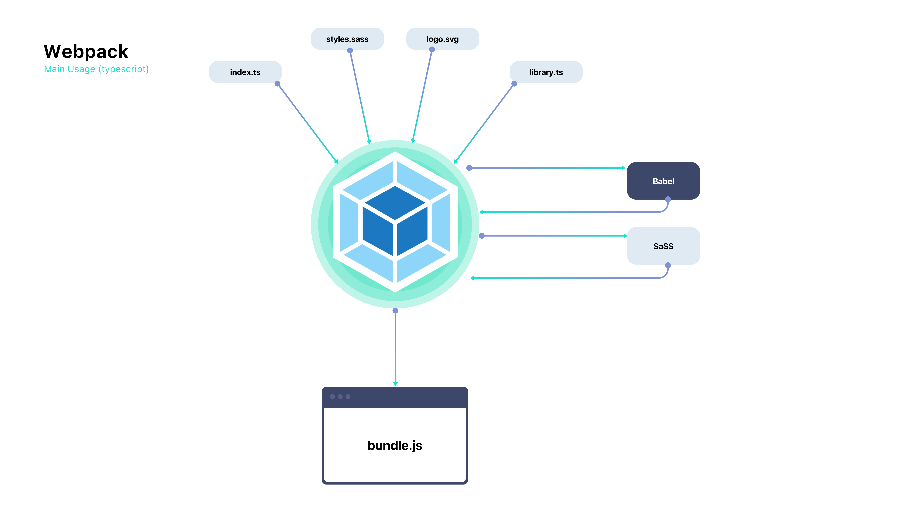

# Webpack with Babel for Typescript

In this template we will check a Typescript app with retrocompatibility to older versions thanks to Babel.

## Requirements

* [Node](https://nodejs.org/en/)


## Introduction

* **[Webpack](https://webpack.js.org)** -> Webpack is a bundler for modules. Main purpose is to bundle JavaScript modules in a browser.
* **[Babel](https://babeljs.io)** -> Javascript compiler, tansform modern Javascript into older versions.
* **[Typescript](https://www.typescriptlang.org)** -> Typescript is an open-source typed language which build on Javascript.

## Goal

The Goal of this application is to bundle all the files in development process to a single file called **bundle.js** which will be deployed as a single file with retrocompatibility.



## Setup

1. Download node and run the following command

```
npm install
```

2. Develop your project

You can start to develop your project, use the ```index.html```, ```index.ts```, and ```styles.scss``` files to start the development process. These files, alongside all the imports will be later bundled and compiled onto a minimize version in the ```./dist/*``` folder.

3. Start dev server

To start a new dev server with auto-reloading just run ```npm run type-check:watch``` to start a new webserver.

## Deployment

To create a production build:

```
npm run build
```

## Script

If you want to create a deployment zip file including a dockerized server that serves your webapp through the 443 and 80 ports just run the **deploy.sh** script.
The script accepts de following arguments

```
bash deploy.sh -u yourdomain.com -d NameOfFile
```

### Certificates
Right now the certificates are self firmed and invalid, just replace the old certificates inside *nginx/certificates* with the new ones and modify the *nginx.conf* file with the new name of the files.